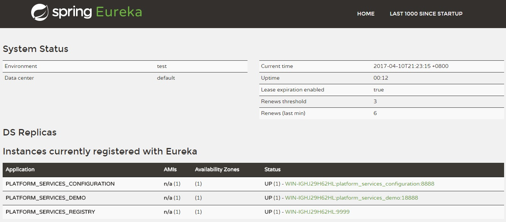

# platform_services_registry

> as a registry service to help consumer applications to registry , renew , cancel , delete service in the distributed system.


```
eureka: 
  dashboard:
    path: eurekaui #dashboard
  instance:
    appname: platform_services_registry
    hostname: localhost
  client:
    registerWithEureka: true  #是否将eureka自身作为应用注册到eureka注册中心
    fetchRegistry: false       #为true时，可以启动，但报异常：Cannot execute request on any known server
    serviceUrl:
      defaultZone: http://${eureka.instance.hostname}:${server.port}/eureka/
```




